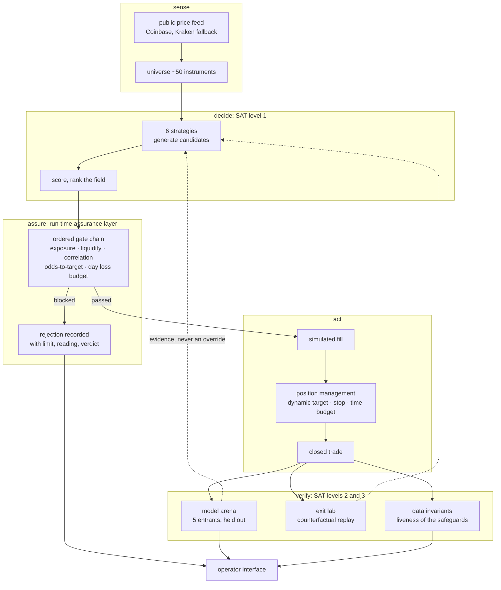

# Surfacing the Black Box: Runtime Transparency for a Statistical Decision Pipeline

**A working system, and a negative result.**

A research desk that watches live market data, decides what it *would* trade,
and renders its entire reasoning chain in a live operator interface: candidate
generation, feature weighting, competing models, held-out validation, and every
risk gate. It cannot place an order; the broker integration was removed before
publication.

---

## Why this exists, and why it is crypto

I cannot publish my previous employer's data, and I do not have access to yours.
So this is the alternative: find a domain with a free, high-volume, continuously
updating public data feed, and build the engineering around it in the open.

Crypto is the cleanest such feed available. It needs no credentials, no licence
and no vendor relationship, and roughly fifty instruments quote twenty-four
hours a day. It was chosen for **data availability and nothing else**. Nothing
in this project depends on the domain being finance; the same apparatus would
sit on sensor telemetry, manufacturing yield, or claims data with the nouns
changed (see [`docs/METHOD.md` §9](docs/METHOD.md)).

**The trading is the substrate. The engineering is the subject.** What is being
demonstrated is:

- a **test suite** derived from real failures rather than imagined ones, 59
  files and 548 test functions, each traceable to the incident that caused it
- **quality assurance and control at the data layer**, carried by fifteen
  invariants that ask whether the running system's output is true of the world,
  not whether the code compiles
- **transparent statistical validation** built from held-out splits, a
  no-variable control model, bootstrap confidence intervals, and **stated
  acceptance criteria that are enforced in code**, including the criterion that
  refused to promote this system's own best model
- an explicit account of **what happens when the program misbehaves**, covering
  hazard analysis, fault trees over incidents that actually occurred, and the
  gates and invariants that now stand where each one got through

The method, written out step by step in the vocabulary each engineering field
uses for it, is in **[`docs/ENGINEERING.md`](docs/ENGINEERING.md)**.

That the strategy does not clear its own cost floor is a **result**, not a
disappointment. A measurement apparatus that only confirms what you hoped for is
not a measurement apparatus.

---

## Abstract

Statistical and machine-learning decision pipelines are conventionally opaque at
runtime. Their validation lives in notebooks, their model selection in
experiment logs, and their guard conditions in code. None of it is visible to
the person accountable for the system while it is running. The literature has
addressed this from two directions that do not meet: **transparency artifacts**
(model cards, datasheets, FactSheets) are offline documents authored once
[1,2,3], and **runtime monitoring** is machine-facing telemetry designed to
trigger alerts rather than to be reasoned about [12,13,29].

This project takes the position that the assurance argument itself should be a
live, inspectable interface, answering *why this decision, on what evidence,
with which checks passed*. It implements that for a complete decision pipeline
over public cryptocurrency market data: 6 strategies, ~50 instruments, a
five-entrant model competition scored on held-out data, and an ordered pre-trade
gate chain, all continuously exposed through a UI organised along the three
levels of the Situation-awareness-based Agent Transparency model [23].

The measured result for the trading task is **negative and reported as such**.
Round-trip cost on the venue studied is ~1.90% against a typical daily range of
2–3%; no strategy clears that bar, and the leading entry model's held-out AUC
confidence interval includes chance. The engineering contribution is the harness
that establishes this reliably rather than the strategies it evaluates.

---

## 0. Method, and how to read this

Each part of this system is a named engineering process with a canonical
sequence of steps. **[docs/METHOD.md](docs/METHOD.md)** sets out those steps
explicitly: hazard analysis (STPA and HARA), risk management (ISO 31000),
verification and validation (IEEE 1012-2024), test engineering
(ISO/IEC/IEEE 29119), quality and closed-loop corrective action, the data
pipeline, and model validation. It then maps each step onto what was actually
done here, with the measured numbers.

**[docs/ENGINEERING.md](docs/ENGINEERING.md)** is the worked companion to that
map. Seven techniques appear there: test design, data-quality validation, risk
management, fault tree analysis, V&V planning, traceability and FRACAS. Each
carries its numbered procedure, the real code in this repository that implements
it, the threshold it is judged against, and an explicit statement of what it
does *not* establish. It is written to be useful to anyone who has built
something substantial and cannot yet name the methods they used.

It also gives the **domain swap**: the same step with the subject changed from
market data to vehicles, aircraft, robots or a production line. The method does
not change; only the nouns do.

---

## 1. The problem

A decision system that cannot be interrogated while it is running has two
failure modes, and they are opposite:

1. **Unwarranted trust.** The operator cannot see that a model is extrapolating
   beyond its validated envelope, so they act on it anyway.
2. **Unwarranted rejection.** The operator sees an unexplained intervention,
   assumes malfunction, and disables the safeguard.

Both are documented consequences of poorly calibrated automation transparency
[20,21]. Lee and See's synthesis makes the mechanism explicit: appropriate
reliance depends on the operator being able to see the automation's **purpose,
process and performance** [20]. Absent that, trust is not calibrated. It is
merely high or low.

This is sharper for statistical pipelines than for deterministic control, for
the reason ISO 21448 (SOTIF) exists [15]: the hazard is not component failure
but **functional insufficiency**, the system operating exactly as specified and
still being wrong, because the specification or the fitted model did not cover
the situation. A fault-based safety frame such as ISO 26262 [16] does not reach
that class of hazard, and no amount of road-style accumulation testing resolves
it either [19].

**The claim of this project:** the artifact that demonstrates a statistical
system is behaving acceptably should be a continuously-rendered argument, not a
document written once and a log nobody opens.

---

## 2. Related work, and the gap

### 2.1 Transparency artifacts: right content, wrong tense

Model Cards [1] standardise what must be disclosed about a trained model:
intended use, training conditions, and disaggregated performance. Datasheets for
Datasets [2] does the same for data provenance. FactSheets [3] reframes both as a
*supplier's declaration of conformity*, borrowing an instrument from regulated
manufacturing. All three establish disclosure as an obligation rather than a
courtesy. All three also produce a **static document describing a past
evaluation**. None updates as the system runs.

### 2.2 Interpretability: the argument for showing the real path

Rudin argues that post-hoc explanations of black boxes are approximations that
can be systematically wrong, and that high-stakes decisions should use models
interpretable by construction [4]. Lipton's decomposition of "interpretability"
into simulatability, decomposability and algorithmic transparency [5] gives the
precision this project needs: **what is surfaced here is decomposability and
algorithmic transparency of the pipeline**, the actual arithmetic that ranked
the candidates, rather than a saliency-style story told about it afterwards.

This is why every variable in the interface is tagged by the role it plays:
`ranks` (enters the score), `gate` (can refuse, does not rank), or `recorded`
(stored, affects nothing today). Most are `recorded`, and saying so is the point.

### 2.3 Production readiness and ML testing: the enumerable part

The ML Test Score [6] defines 28 concrete tests and monitors across data, model,
infrastructure and monitoring, and scores a system on how many it satisfies.
This is the closest thing ML has to a readiness gate in the V&V sense, and it
establishes that **validation state is an enumerable, scoreable thing**, which
is precisely what makes it renderable. Hidden Technical Debt [7] names the
failure modes conventional software practice misses: entanglement, undeclared
consumers, hidden feedback loops. Zhang et al.'s survey [8] maps ML testing onto
the conventional testing vocabulary of oracles, adequacy criteria and mutation,
and Breck et al. [9] show that most production incidents originate in **input**
validation rather than model validation.

### 2.4 Runtime assurance: bounding what you cannot verify

Sha's Simplex architecture [10] is the canonical pattern: pair an unverified
high-performance controller with a simple verified safety controller and a
decision module that switches between them. ASTM F3269 [11] formalises this as
run-time assurance and makes it certifiable practice, not just a paper. In
robotics, Rahman et al. survey runtime detection of a perception model operating
outside its competence [12], and runtime verification provides the formal
vocabulary for checking an execution trace against a property [13].

The gate chain in this system is a run-time assurance layer in exactly this
sense. **What is unusual is that the decision module is rendered for a human
rather than only acted upon.**

### 2.5 Assurance cases: the argument as the deliverable

UL 4600 [14] requires the developer of an autonomous product to produce a
*safety case*: a structured argument with evidence, rather than conformance to a
prescriptive process. AMLAS [17] gives a six-stage methodology for building such
a case around an ML component, and GSN [18] supplies the notation of goals,
strategies, solutions, context and assumptions. Burton et al. [19b] work an
assurance argument through for an ML perception function and are candid about
where the evidence is weakest: dataset coverage, generalisation claims, and the
absence of a specification to verify against.

Read through this lens, the interface here is a **live GSN fragment**: gates are
goals, displayed readings are solutions, and the operating-envelope statements
are context and assumptions.

### 2.6 Human factors: what the display is actually for

Endsley's model defines situation awareness as perception, comprehension and
projection [22]. Chen et al.'s SAT model operationalises this for autonomous
agents: an agent should communicate (L1) its current goal and action, (L2) its
reasoning and constraints, and (L3) its projected outcome with uncertainty [23].
That is a specification, not a metaphor, and the interface is organised along
it. A cautionary empirical result [24] shows that displaying **confidence**
improved trust calibration while local feature explanations did not reliably do
so. That is why calibrated odds and validation state are given more prominence
than per-decision narratives.

### 2.7 Methodology pitfalls the interface is designed to expose

Kaufman et al. formalise leakage as information about the target that would not
legitimately be available at prediction time [25]; Kapoor and Narayanan find
leakage-driven irreproducibility across 294 papers in 17 fields [26]. In the
financial-evaluation literature specifically, Bailey and López de Prado show
that a Sharpe ratio must be corrected for the number of configurations tried
[27], and that the probability of backtest overfitting is itself estimable [28].
They make the stronger claim that **failing to report trial count is a form of
misrepresentation**, not a stylistic omission.

### 2.8 Observability: inspectable on demand, not a fixed dashboard

Shankar and Parameswaran argue that ML pipelines need *observability*, the
ability to ask arbitrary post-hoc questions about why a pipeline behaved as it
did, rather than a fixed set of pre-chosen metrics [29]. Interview work with
MLOps engineers [30] and the broader deployment survey [31] document what
practitioners actually need to see.

### 2.9 The gap

The transparency literature (§2.1) is **offline and document-shaped**. The
runtime literature (§2.4, §2.8) is **machine-facing**: monitors that fire, not
arguments that are read. The human-factors work (§2.6) specifies *what* an agent
should communicate but is demonstrated on control and robotics tasks, not on
statistical model-selection pipelines.

This project occupies the intersection: **an assurance-style argument over a
statistical pipeline, rendered continuously for a human operator.** It is a
systems-engineering contribution rather than a novel algorithm, and it is
offered as a worked instance rather than a general method.

---

## 3. System



The dotted edges are load-bearing: **measurement never silently rewires
trading.** A model that scores well is reported as evidence for a change, not
applied as one. This preserves the property that the acting path is the one that
was verified, the same separation Simplex [10] and F3269 [11] rely on.

```
tradecrypto/
├── backend/app/
│   ├── strategy/        22 modules, the decision rules
│   │   ├── time_budget.py      P(target reached | ratio, age, P&L),
│   │   │                       from 4.9M historical observations
│   │   ├── dynamic_target.py   a target that re-prices as odds decay
│   │   └── hour_profile.py     empirical-Bayes shrinkage per hour;
│   │                           reports a FLAT profile when the
│   │                           between-hour variance is noise
│   ├── risk/guards.py          the ordered gate chain + day stop
│   ├── execution/
│   │   ├── broker.py           paper + advisory only
│   │   ├── venue_fees.py       published fee schedule, the 1.90%
│   │   └── no_broker.py        the deliberate absence, made explicit
│   ├── research/        36 modules, the harness
│   │   ├── model_arena.py      5 entrants, time-split, bootstrap CIs
│   │   ├── decision_tree.py    the live transparency endpoint
│   │   ├── exit_lab.py         counterfactual replay of exit rules
│   │   ├── invariants.py       data-integrity checks with teeth
│   │   └── stats.py            bootstrap CI, deflated Sharpe, PBO
│   └── core/
│       ├── liveness.py         has each safeguard ever actually FIRED?
│       └── vault.py            append-only, hash-chained audit log
├── backend/tests/       58 files · 541 tests
└── frontend/src/        37 components, the interface
```

**116 Python files / 34,029 lines · 541 tests / 7,910 lines · 37 UI components.**

---

## 4. What is surfaced, and why

Organised along SAT levels [23], with Lee and See's purpose/process/performance
triad [20] as the acceptance criterion.

| SAT level | Rendered | Grounding |
|---|---|---|
| **L1.** Goal and action | Which instruments were considered, which passed, which was funded, and the scoring expression that ranked them | decomposability [5] |
| **L2.** Reasoning and constraints | Every variable with its live value and role (`ranks` / `gate` / `recorded`); every gate with its limit, reading and verdict; the model competition with held-out AUC and CI | ML Test Score as enumerable state [6]; GSN goals and solutions [18] |
| **L3.** Projection with uncertainty | Probability the target is reached given ratio, age and current P&L; time-to-target quantiles; the explicit statement when no model beats chance | calibrated confidence over explanation [24] |

Three design rules follow from the literature and are enforced in code:

1. **Show the real path, not a story about it** [4,5]. The displayed expression
   is the one that executed.
2. **Show refusals, not only successes** [21]. Every blocked candidate records
   why, because disuse caused by unexplained interventions is a documented
   failure mode.
3. **Show the limits of the evidence** [19b,26,27]. Trial counts, confidence
   intervals and "not enough data yet" are first-class display states.

---

## 5. Validation methodology

### 5.1 A control with no variables in it

For each strategy, five models are fitted on its own past signals and scored on
held-out data:

| entrant | role |
|---|---|
| all variables | the widest model |
| all variables, heavily regularised | wins when the wide model memorised |
| strongest 5, refitted | fewer parameters, less room to overfit |
| single best variable | if this ties, the rest are decoration |
| **no variables at all** | **the control** |

The control scores AUC 0.500 by construction. Without it in the table, the best
of five uninformative models reads as a winner. This is the multiple-comparison
discipline of [27,28] applied at model-selection time.

### 5.2 Split by time, never shuffled

Oldest 70% trains; newest 30% is held out and read once. Shuffling a price
series permits learning from an afternoon to predict that morning. That is
leakage in the formal sense of [25], and the single most common source of the
irreproducibility documented in [26].

### 5.3 Crowned on the interval, not the point estimate

The leading entrant scored **AUC 0.786**, with a 95% bootstrap interval of
**[0.40, 1.00]** on 11 held-out observations. The system reports **no champion**.
Ranking the entrants against one another in that regime is ranking noise.

### 5.4 Effective sample size under correlation

Eleven concurrent positions had an average pairwise correlation of **+0.43**.
Effective independent bets, `N / (1 + (N−1)r)`: **2.1**. Every per-trade
significance figure computed before this correction was overstated by
approximately that factor.

### 5.5 Degenerate-variance handling

A confidence score of the form `mean / (sd/√n)` divides by zero when all
observations are identical, and the obvious guard returns the score of a coin
flip for the *most certain* result in the sample. A strategy losing 3% on all 20
trades therefore scored "undecided" and would never have been retired.

---

## 6. Results

| measured | value |
|---|---|
| Round-trip cost, venue studied | **~1.90%** (0.95%/side, embedded in the spread, with no line item stating it) |
| Typical daily range of instruments traded | **2–3%** |
| Best exit rule found, 106 trades | **+0.61%** per trade |
| Perfect-hindsight ceiling, same trades | **+7.53%** |
| Best entry model, held-out AUC | **0.786**, 95% CI **[0.40, 1.00]**, which includes chance |
| Effective independent bets from 11 positions | **2.1** |

**No strategy clears its own transaction cost.** A signal must be right by more
than an entire day's normal move before it earns anything, and none is.

This is reported as the result rather than buried. An evaluation that models
commission and ignores the spread produces a profit that cannot exist. That is
the failure mode [27,28] describe as pseudo-mathematics, and the reason the cost
model is a first-class module rather than a constant.

---

## 7. Threats to validity

- **Single venue, single asset class.** Cost structure and microstructure are
  specific to one retail venue over one period.
- **Sample size.** Held-out slices are small; §5.3 is the consequence, not an
  aside.
- **Survivorship in the instrument universe.** The traded set is drawn from
  currently-listed instruments.
- **The transparency claim is unevaluated.** Doshi-Velez and Kim [32]
  distinguish application-grounded, human-grounded and functionally-grounded
  evaluation of interpretability. Only the functionally-grounded argument is
  offered here: the information is present and correct. **No user study was
  run**, so no claim is made that operator decisions improved.
- **Simulated fills.** Paper execution models the spread but not queue position,
  partial fills or market impact.

---

## 8. Failure-driven testing

Most of the 541 tests exist because something broke. Each encodes one incident:
symptom, root cause, and the check that now catches it. This is the practice [6]
formalises as a readiness rubric and [7] explains the need for.

| failure | lesson |
|---|---|
| A rate tuned on hourly bars, applied per tick | the live loop ran 60× faster than the backtest; correct in every test, because the tests also walked bars |
| `git` cannot store an empty directory | the launcher died on a fresh clone, at a path present on every developer machine |
| A missing binary wheel is not an error | the installer silently compiled for 15+ minutes, then failed |
| A hand-written list of "the compiled packages" | missed the transitive dependency nobody lists, and the next failure was in it |
| A string prefix is not a parent directory | a correctly-placed audit log reported itself compromised |
| Sample data with backdated timestamps | aged every "has this run lately" check; a five-minute-old install accused itself |
| An undefined name inside a broad `try/except` | silent forever: the feature wrote nothing and nothing ever failed |

The last is why an undefined-name gate runs over every language in the project.
Undefined names only. A linter that also argues about style is switched off
within a week and takes the useful rule with it.

---

## 9. Running it

Python 3.11–3.14. Node optional: a built dashboard ships in the repository and
the backend serves it when no toolchain is present.

```bash
git clone https://github.com/pouriaetab/tradecrypto.git ~/tradecrypto
cd ~/tradecrypto && bash run.sh
```

Prices come from public endpoints: no account, no API key, no credentials. On
first run it offers a demo, the real strategies replayed over real stored prices
with the real cost model, so every view is populated before any live data exists.

```bash
cd backend && .venv/bin/python -m pytest -q     # 541 tests
bash run.sh --doctor                            # environment diagnosis
```

---

## 10. What is deliberately absent

The broker client, the order-placing path and the live execution mode were
removed before publication; `backend/app/execution/no_broker.py` is what the API
layer imports in their place. A research tool that can move real money is a
liability rather than a feature, and *"it defaults to paper"* is a weaker
guarantee than not possessing the capability.

Not financial advice and not a trading system. See [DISCLAIMER.md](DISCLAIMER.md).
MIT licensed with **no warranty**. See [LICENSE](LICENSE).

---

## References

1. Mitchell, M. et al. (2019). *Model Cards for Model Reporting.* ACM FAT\*. https://arxiv.org/abs/1810.03993
2. Gebru, T. et al. (2021). *Datasheets for Datasets.* Communications of the ACM 64(12). https://arxiv.org/abs/1803.09010
3. Arnold, M. et al. (2019). *FactSheets: Increasing Trust in AI Services through Supplier's Declarations of Conformity.* IBM J. Res. & Dev. 63(4/5). https://arxiv.org/abs/1808.07261
4. Rudin, C. (2019). *Stop Explaining Black Box Machine Learning Models for High Stakes Decisions and Use Interpretable Models Instead.* Nature Machine Intelligence 1:206–215. https://www.nature.com/articles/s42256-019-0048-x
5. Lipton, Z. C. (2018). *The Mythos of Model Interpretability.* ACM Queue 16(3). https://arxiv.org/abs/1606.03490
6. Breck, E. et al. (2017). *The ML Test Score: A Rubric for ML Production Readiness and Technical Debt Reduction.* IEEE Big Data. https://ieeexplore.ieee.org/document/8258038
7. Sculley, D. et al. (2015). *Hidden Technical Debt in Machine Learning Systems.* NeurIPS 28. https://papers.nips.cc/paper/5656-hidden-technical-debt-in-machine-learning-systems
8. Zhang, J. M. et al. *Machine Learning Testing: Survey, Landscapes and Horizons.* IEEE TSE. doi:10.1109/TSE.2019.2962027. https://arxiv.org/abs/1906.10742
9. Breck, E. et al. (2019). *Data Validation for Machine Learning.* MLSys. https://mlsys.org/Conferences/2019/doc/2019/167.pdf
10. Sha, L. (2001). *Using Simplicity to Control Complexity.* IEEE Software 18(4):20–28. https://ieeexplore.ieee.org/document/936213
11. ASTM International (2021). *F3269-21: Standard Practice for Methods to Safely Bound Behavior of Aircraft Systems Containing Complex Functions Using Run-Time Assurance.* https://store.astm.org/f3269-21.html
12. Rahman, Q. M., Corke, P., Dayoub, F. (2021). *Run-Time Monitoring of Machine Learning for Robotic Perception: A Survey of Emerging Trends.* IEEE Access. https://arxiv.org/abs/2101.01364
13. Bartocci, E. et al. (2018). *Introduction to Runtime Verification.* In Lectures on Runtime Verification, LNCS 10457. https://link.springer.com/chapter/10.1007/978-3-319-75632-5_1
14. Underwriters Laboratories (2023). *UL 4600: Standard for Evaluation of Autonomous Products*, 3rd ed. https://ulse.org/focus-areas/travel-safety/autonomous-vehicles/
15. ISO (2022). *ISO 21448:2022 — Road vehicles: Safety of the Intended Functionality (SOTIF).* https://www.iso.org/standard/77490.html
16. ISO (2018). *ISO 26262:2018 — Road vehicles: Functional safety.* https://www.iso.org/standard/68383.html
17. Hawkins, R. et al. (2021). *Guidance on the Assurance of Machine Learning in Autonomous Systems (AMLAS).* University of York. https://arxiv.org/abs/2102.01564
18. SCSC Assurance Case Working Group (2021). *GSN Community Standard v3 (SCSC-141C).* https://scsc.uk/scsc-141c
19. Koopman, P., Wagner, M. (2016). *Challenges in Autonomous Vehicle Testing and Validation.* SAE 2016-01-0128. https://www.sae.org/publications/technical-papers/content/2016-01-0128/
19b. Burton, S., Gauerhof, L., Heinzemann, C. (2017). *Making the Case for Safety of Machine Learning in Highly Automated Driving.* SAFECOMP Workshops, LNCS 10489. https://link.springer.com/chapter/10.1007/978-3-319-66284-8_1
20. Lee, J. D., See, K. A. (2004). *Trust in Automation: Designing for Appropriate Reliance.* Human Factors 46(1):50–80. https://journals.sagepub.com/doi/10.1518/hfes.46.1.50_30392
21. Parasuraman, R., Riley, V. (1997). *Humans and Automation: Use, Misuse, Disuse, Abuse.* Human Factors 39(2):230–253. https://journals.sagepub.com/doi/10.1518/001872097778543886
22. Endsley, M. R. (1995). *Toward a Theory of Situation Awareness in Dynamic Systems.* Human Factors 37(1):32–64. https://journals.sagepub.com/doi/10.1518/001872095779049543
23. Chen, J. Y. C. et al. (2018). *Situation Awareness-Based Agent Transparency and Human-Autonomy Teaming Effectiveness.* Theoretical Issues in Ergonomics Science 19(3):259–282. https://www.tandfonline.com/doi/full/10.1080/1463922X.2017.1315750
24. Zhang, Y., Liao, Q. V., Bellamy, R. K. E. (2020). *Effect of Confidence and Explanation on Accuracy and Trust Calibration in AI-Assisted Decision Making.* ACM FAT\*. https://arxiv.org/abs/2001.02114
25. Kaufman, S. et al. (2012). *Leakage in Data Mining: Formulation, Detection, and Avoidance.* ACM TKDD 6(4). https://dl.acm.org/doi/10.1145/2382577.2382579
26. Kapoor, S., Narayanan, A. (2023). *Leakage and the Reproducibility Crisis in Machine-Learning-Based Science.* Patterns 4(9). https://arxiv.org/abs/2207.07048
27. Bailey, D. H., López de Prado, M. (2014). *The Deflated Sharpe Ratio.* J. Portfolio Management 40(5):94–107. https://papers.ssrn.com/sol3/papers.cfm?abstract_id=2460551
28. Bailey, D. H. et al. (2017). *The Probability of Backtest Overfitting.* J. Computational Finance 20(4):39–69. https://papers.ssrn.com/sol3/papers.cfm?abstract_id=2326253
29. Shankar, S., Parameswaran, A. (2022). *Towards Observability for Production Machine Learning Pipelines.* PVLDB 15(13). https://www.vldb.org/pvldb/vol15/p4015-shankar.pdf
30. Shankar, S. et al. (2024). *"We Have No Idea How Models will Behave in Production until Production": How Engineers Operationalize Machine Learning.* ACM CSCW. https://arxiv.org/abs/2403.16795
31. Paleyes, A., Urma, R.-G., Lawrence, N. D. (2022). *Challenges in Deploying Machine Learning: A Survey of Case Studies.* ACM Computing Surveys 55(6). https://arxiv.org/abs/2011.09926
32. Doshi-Velez, F., Kim, B. (2017). *Towards A Rigorous Science of Interpretable Machine Learning.* arXiv preprint. https://arxiv.org/abs/1702.08608
