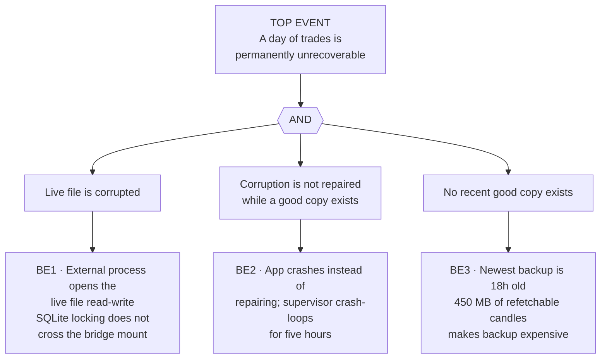

# Engineering method, worked on a real system

Seven techniques from safety, quality and test engineering, each named the way
its own field names it, each applied to code in this repository, each with the
threshold it is judged against and the honest limit of what it establishes.

### Who this is for

People who have built something real and cannot say what they did.

There is a specific way this goes wrong. You solve a problem, it seems obvious
once solved, you file it under "I just fixed a bug", and you move on. Later you
hear someone describe the same move in a systematic-sounding vocabulary and
assume they know something you do not. Usually they do not. They have a name
for it, and a name is what survives a forty-five minute interview.

This document is the mapping in the other direction: here is a thing that was
actually done in this codebase, and here is what the field calls it.

### How to read a section

Every section has the same six parts:

1. **The name** — formal designation and the standard it comes from
2. **The procedure** — numbered steps, the way the method is actually run
3. **Applied here** — the real file, the real code, the real incident
4. **What it catches** — the failure it is built to detect
5. **The threshold** — the acceptance criterion, and where the number came from
6. **The honest limit** — what this does *not* establish

Part 6 is not modesty. It is the part that makes the other five believable, and
in an interview it is usually the part that gets remembered. See
[`METHOD.md` §11](METHOD.md) for the claims this project does not support.

### The system under discussion

An automated crypto trading system and its transparency dashboard: 116 Python
modules, 59 test files, 548 test functions, ~50
instruments on a 15-second poll. The system's headline result is negative — the
strategy does not clear its own transaction-cost floor — which is why the
measurement apparatus is the interesting part rather than the strategy.

---

<details>
<summary><b>1 · Test design and categorization</b> — ISO/IEC/IEEE 29119-4:2021</summary>

### The name

**Test design techniques**, standardised in ISO/IEC/IEEE 29119-4. The standard
splits them three ways: *specification-based* (black-box, derived from what the
thing should do), *structure-based* (white-box, derived from the code's shape),
and *experience-based* (derived from where defects have actually been found).

Most people write tests without knowing these have names. Naming them is what
lets you say "the suite is weak on boundary-value coverage for the sizing path"
instead of "I should probably write more tests".

### The procedure

1. **Pick the test basis** — the thing you are deriving tests *from*. A
   requirement, a specification, an interface, a piece of code, an incident
   report. If you cannot name the basis, you are writing tests from vibes.
2. **Choose the technique** that fits the basis:
   - **Equivalence partitioning** — split the input space into classes where
     every member should behave the same, then test one member per class.
   - **Boundary value analysis** — test the edges of each class, because that
     is where off-by-one and comparison-operator defects live.
   - **Decision table testing** — for logic with several interacting
     conditions; enumerate the combinations and their expected outcomes.
   - **State transition testing** — for anything with modes; test the legal
     transitions *and* the illegal ones.
   - **Combinatorial / pairwise** — when the full cross-product is too large,
     cover every *pair* of parameter values instead.
   - **Error guessing** — deliberate, experience-driven attacks on where this
     kind of system usually breaks.
3. **Derive test cases** and record which technique produced each one.
4. **Assign a coverage item** to each — the specific partition, boundary, rule
   or transition the case covers.
5. **Measure coverage** against those items, not against lines of code.
6. **Record the residual** — the coverage items you chose not to cover, and why.

### Applied here

The suite splits into categories worth naming separately, because they catch
different classes of defect:

| Category | Count | What it is |
|---|---|---|
| Behavioural unit and integration tests | ~39 files | Ordinary specification-based tests over functions and modules |
| **Architectural fitness functions** | **20 files** | Tests that read the *source* with `inspect.getsource` and assert structural properties |
| Data-driven (`parametrize`) | 8 files | One test body, many input classes — equivalence partitioning made literal |
| Isolation (`monkeypatch`) | 22 files | Dependencies replaced so the unit under test is genuinely alone |
| Filesystem-isolated (`tmp_path`) | 5 files | Anything touching the database or vault, on a private copy |
| Process-level (`subprocess`) | 4 files | The install, the clone, the day boundary — tested as a user meets them |

The second row is the unusual one and the one worth being able to explain. An
**architectural fitness function** (the term is Ford, Parsons & Kua's) is a test
whose subject is a structural property of the system rather than its output.
This suite has twenty files of them. Example, from
`backend/tests/test_model_arena.py`:

```python
def test_the_split_is_by_time_and_never_shuffled():
    """The single most expensive mistake available here."""
    src = inspect.getsource(arena.run)
    assert "X[:cut]" in src and "X[cut:]" in src, (
        "the split must slice a time-ordered array, not sample it"
    )
    body = src.split('"""', 2)[-1]          # drop the docstring
    code = "\n".join(l for l in body.splitlines()
                     if not l.strip().startswith("#"))
    for bad in ("shuffle(", "permutation(", "train_test_split(", "random.sample("):
        assert bad not in code, f"{bad} in the split destroys the time ordering"
```

The defect it targets — shuffling a price series before a train/validate split —
produces **no failing output at all**. The model trains, scores well, and every
number downstream is inflated by temporal leakage. There is no assertion on a
return value that can catch it, because the return value looks *better* when the
bug is present. So the test asserts on the shape of the code instead.

Note the comment in the middle. An earlier version of this test searched for the
bare word `shuffle` and failed on the module's own sentence explaining why it
does not shuffle. **A test that fires on its subject's documentation is noise**,
and stripping docstrings and comments before matching is the fix.

Boundary-value analysis appears twice. `test_daily_limit_bounds.py` is the
purpose-built case: the operator-settable daily loss limit is the only risk
control here that can be moved while the system runs, so its partition edges
(0.5% and 50%), the values just outside them, and the two degenerate values
(0% halts on the first cent, 1000% is no cap) are each a case. The read path is
covered as well as the write path, because a bound enforced only on input is one
hand-edited row away from not existing.

A second instance, from the model arena — the control entrant:

```python
def test_the_control_alone_cannot_be_a_champion(monkeypatch):
    y = np.array([1.0, 0.0] * 12)
    p = np.full(len(y), 0.5)
    sc = arena._score(y, p)
    assert sc["auc"] == pytest.approx(0.5, abs=1e-9)
    assert sc["beats_chance"] is False
```

A constant predictor has AUC exactly 0.5 by construction. That is the boundary.
If a champion is ever selected whose AUC equals the control's, the ranking logic
has inverted, and this test is the thing that says so.

### What it catches

- Defects that produce **better-looking output**, which no output assertion can find
- Structural regressions — someone "simplifies" the split to `train_test_split`
- Off-by-one and comparison errors at partition edges
- Illegal state transitions, e.g. a retired strategy re-entering the book

### The threshold

Coverage is measured against *coverage items*, not line percentage. The suite's
operative rule is stated in `test_fresh_clone.py`: the existing suite tested
**functions**, and every failure that shipped was in the **path a new user
walks**. So the acceptance criterion for this repository is:

> Every failure that has ever reached a user has a test that reproduces it, and
> that test exercises the path at the level the user met it — process level if
> they met it at a terminal, data level if they met it on a dashboard.

Line coverage is deliberately not a target. A suite can hit 90% of lines and
still never ask whether a closed trade points at the order that closed it.

### The honest limit

- **No property-based testing.** Zero use of Hypothesis. `test_core.py` calls
  itself "property tests" but uses hand-written inputs, which is not the same
  thing. Generating inputs to find counterexamples would strengthen the numeric
  code, and has not been done.
- **No API-level integration tests.** No FastAPI `TestClient` anywhere. Routes
  are tested through their handler functions, so the wiring between HTTP layer
  and handler is unverified.
- Architectural fitness functions are **brittle by nature** — they break on
  refactors that are correct. That is a real cost, accepted deliberately here
  because the defects they catch are silent.

</details>

---

<details>
<summary><b>2 · Data-quality validation</b> — post-conditions on a running system</summary>

### The name

**Data quality assurance**, assessed along the dimensions ISO/IEC 25012 and the
DAMA framework share: *completeness, uniqueness, validity, consistency,
timeliness, accuracy*. In practice the useful distinction is narrower and
sharper than the dimension list:

> A unit test asks whether a function returns the right value.
> A **post-condition on the data** asks whether the running system's output is
> actually true of the world.

The second kind catches a class the first kind structurally cannot.

### The procedure

1. **State the invariant as a question a non-engineer can check.** Not
   `assert row.open_order_id is not None` but "does every closed trade point at
   the orders that opened and closed it?"
2. **Name the bug it would have caught.** If you cannot, the invariant is
   decorative.
3. **Set a severity** — is a violation broken, or a warning?
4. **Run it on a schedule, not only in the test suite.** This is the step people
   skip and it is the whole point; see below.
5. **Land results in an event log** and surface them in the interface.
6. **Run the same functions in the test suite too**, so the gate also fails in
   preflight.

### Applied here

The motivating incident, quoted verbatim in the module header of
`backend/app/research/invariants.py`:

> "on this 'trades.open_order_id was NULL on all 16 rows'; how come you missed
> this. please put in tests on these so we dont have these types of issues
> anymore"

And the module's own answer, which is the most useful paragraph in this
repository:

> The honest answer to "how come you missed this" is that every check this repo
> had was a check on the CODE — does it compile, are all names defined, does
> every component import, does every CSS variable resolve. The linkage code
> existed, read correctly, and was wrong about the world.

Fifteen invariants are registered:

```python
CHECKS = [
    known_gaps_are_declared,          trades_link_to_orders,
    trades_reach_their_features,      orders_link_to_signals,
    pnl_decomposes,                   costs_never_below_published,
    holds_are_not_collapsed,          no_slot_cap_is_binding,
    open_positions_carry_their_order, equity_reconciles,
    reports_carry_a_shape,            targets_are_plausible,
    no_position_risks_more_than_the_day,
    book_risk_within_drawdown,        prices_on_screen_are_fresh,
]
```

Each one returns the same shape, and the shape is the design:

```python
def _result(name: str, question: str, ok: bool, detail: str,
            would_have_caught: str, severity: str = "broken",
            n_bad: int = 0, n_total: int = 0) -> dict:
```

`would_have_caught` is a required argument. A test enforces that every invariant
supplies a real one — `test_every_invariant_declares_what_it_would_have_caught`
— so the registry cannot silently accumulate checks nobody can justify.

One invariant in full:

```python
def trades_link_to_orders() -> dict:
    rows = db.query("SELECT id, open_order_id, close_order_id FROM trades")
    salv = _salvaged_ids()
    bad = [r["id"] for r in rows
           if (r["open_order_id"] is None or r["close_order_id"] is None)
           and r["id"] not in salv]
    return _result(
        "trades_link_to_orders",
        "Does every closed trade point at the orders that opened and closed it?",
        not bad,
        ...,
        "trades.open_order_id was NULL on all 16 rows for four days, which made "
        "it impossible to trace any outcome back to the features that caused it. "
        "Every learner downstream was silently working from nothing.")
```

Note `_salvaged_ids()`. Four trades were recovered from a corrupted database
with their orders permanently destroyed. They can never satisfy this invariant.
Rather than weaken the check or let it alarm forever, the exception is **named,
enumerated and declared** — which is what `known_gaps_are_declared` polices.

### What it catches

Defects where the code is correct and the data is wrong. The NULL linkage
accumulated over four days while every code gate stayed green: imports resolved,
components rendered, CSS variables bound, tests passed. The system was
confidently producing unusable data.

### The threshold

**Scheduled, not on demand.** From the module header:

> A test that runs when somebody remembers to type `pytest` would not have
> caught the NULL either — the trades that were missing their linkage
> accumulated over four days while every code gate stayed green.

So the acceptance criterion has a time dimension: an invariant that only runs in
CI has a detection latency equal to the gap between commits. For data defects in
a continuously running system, that is not good enough. The bar is: **every
invariant runs on a schedule, writes to the event log, and is visible in the
interface without anyone asking for it.**

Severity is two-valued (`broken` / `warning`) on purpose. A three-or-more level
scheme invites arguing about the middle.

### The honest limit

- These check *internal* consistency. They cannot detect that the venue's price
  feed was wrong, only that our records disagree with each other.
- `prices_on_screen_are_fresh` is a timeliness check with a threshold chosen by
  judgement, not derived from a requirement.
- Fifteen invariants is not a complete set and no argument is offered that it is.
  A genuine completeness claim would need a systematic derivation from the data
  model, which has not been done.

</details>

---

<details>
<summary><b>3 · Risk management</b> — ISO 31000:2018 and IEC 31010:2019</summary>

### The name

**Risk management**, per ISO 31000:2018 *Risk management — Guidelines*, with
assessment techniques from IEC 31010:2019 *Risk assessment techniques*.

The single most common interview mistake here is to use "risk" to mean "bad
thing that might happen". ISO 31000 defines risk as **the effect of uncertainty
on objectives** — which means you cannot talk about risk until you have stated
the objective. That definition is the whole reason the process starts where it
does.

### The procedure

1. **Scope, context and criteria.** State the objective. State what level of
   effect is acceptable *before* you measure anything, because a threshold
   chosen after seeing the data is not a threshold, it is a rationalisation.
2. **Risk identification.** What could affect the objective? Techniques from
   IEC 31010: structured what-if, checklists, failure analysis, scenario
   analysis.
3. **Risk analysis.** Likelihood and consequence, and — the step usually
   skipped — the *interactions* between risks.
4. **Risk evaluation.** Compare analysed risk against the criteria from step 1.
   Decide: acceptable, treat, or escalate.
5. **Risk treatment.** ISO 31000 lists the options explicitly: avoid it, take
   more of it to pursue an opportunity, remove the source, change the
   likelihood, change the consequence, share it, or **retain it by informed
   decision**. That last one is a legitimate treatment, and naming it correctly
   is what separates a considered decision from an unmanaged exposure.
6. **Monitoring and review**, and **recording and reporting** — continuous, not
   terminal.

### Applied here

**Step 1 — the criterion, set before measuring.** The objective is to grow a
small book without a single day that ends the experiment. The criterion was
first a fixed daily loss cap, and it was wrong in an instructive way.

**Step 4 — evaluation, which found the criterion itself defective.** From
`backend/tests/test_book_risk_ceiling.py`:

> Was the daily cap for one day; at $60 it refused 32 entries with 11 positions.

A cap that refuses thirty-two entries is not protecting the book, it is
preventing the strategy from existing. The control was measured and found to
be mis-specified.

**Step 5 — treatment, changed.** The fixed cap was replaced by a **drawdown
budget: 10% of equity, less today's realised loss**. The control now scales with
the thing it protects instead of being a number someone typed once.

**Retention by informed decision, implemented as a mechanism.** From
`test_daily_loss_waiver.py`:

> 2026-09-23: $71 down against a $60 cap. Released nine times between 14:22 and
> 18:04.

Read that as a risk-management finding rather than a user complaint. **A control
that is overridden nine times in four hours has already failed as a control.**
The override was a two-minute pause, so the operator had to keep re-making the
same decision, and the record showed nine events where there had been one
decision. The treatment: make the release an explicit, *day-scoped* acceptance —
one decision, recorded once, not re-litigated every two minutes. That is ISO
31000's "retain by informed decision", built as code.

**Step 3 — interaction between risks, which is where most position-sizing goes
wrong.** Eleven open positions look like eleven independent bets. Measured
pairwise correlation across the book was **+0.43**, and the standard adjustment

```
N_effective = N / (1 + (N − 1) · r)
```

gives `11 / (1 + 10 × 0.43)` ≈ **2.1**. The book was carrying about two
independent bets while the interface reported eleven positions. Diversification
that is not measured is an assumption, and here the assumption was wrong by a
factor of five.

### What it catches

- Controls that are mis-specified rather than merely mis-tuned
- Silent acceptance — an exposure being run without anyone having decided to run it
- Correlated exposure presented as diversification
- Thresholds that drifted because nobody recorded why they were set

### The threshold

| Control | Value | Where the number came from |
|---|---|---|
| Book drawdown budget | 10% of equity, less today's realised | Replaced a fixed $60 cap that refused 32 of 43 entries |
| Daily loss limit, operator-settable | 0.5%–50% of stake | Bounds, not a value: 0% halts on the first cent; too large is not a stop. Enforced on read *and* write — `test_daily_limit_bounds.py` |
| Regime size multiplier | capped ×1.5 / ×0.5 | A router that can size to zero or to the moon is not a router |
| Per-coin cost hurdle | per-instrument, not a global 240 bps | BTC's own round trip is nearer 80 bps; the global prior rejected viable trades |
| Minimum trades before the lab acts | `MIN_TRADES = 15` | Below this it records but does not act |

The row that matters most is the second. **The operator sets a value; the code
owns the bounds.** A limit with no bounds is not a control, and a limit the
operator cannot change gets bypassed in ways you never see.

### The honest limit

- Likelihoods here are **estimated from a few hundred trades**, not from a
  qualified reliability dataset. Every probability in this system is an
  empirical frequency with a wide interval, and is treated as such.
- No formal risk register with owners and review dates. The controls are in
  code and in tests; the governance layer around them does not exist, because
  there is one operator.
- The correlation figure is a point estimate on a short window. It moves.

</details>

---

<details>
<summary><b>4 · Hazard analysis, fault trees, and defence in depth</b> — IEC 61025, STPA, LOPA</summary>

### The name

Three distinct methods that people blur together, and the distinction is worth
being able to state cleanly:

| Method | Direction | Asks |
|---|---|---|
| **FTA** (fault tree analysis) | Top-down, deductive | "This bad thing happened. What combinations of failures could produce it?" |
| **FMEA** | Bottom-up, inductive | "This component failed. What does that do to the system?" |
| **STPA** (Leveson & Thomas) | Control-theoretic | "What control action, in what context, would be unsafe?" |

FTA is the right tool when you have a specific top event and want to know
whether any *single* failure can cause it. That is exactly the question below.

### The procedure

1. **Define the top event precisely.** "The system fails" is not a top event.
   "A day of trades is permanently unrecoverable" is.
2. **Identify the immediate, necessary and sufficient causes** of the top event
   — one level only. Resist jumping to root causes.
3. **Connect them with logic gates.** `AND` when all are required; `OR` when any
   one suffices. This is the step that carries all the information.
4. **Decompose each intermediate event** the same way, recursively.
5. **Stop at basic events** — failures you will not decompose further, either
   because they are primitive or because you have data at that level.
6. **Derive the minimal cut sets** — the smallest sets of basic events whose
   joint occurrence causes the top event. A cut set of size 1 is a **single
   point of failure**.
7. **Evaluate.** Qualitatively, rank cut sets by order (smaller = worse).
   Quantitatively, if you have credible failure rates, compute top-event
   probability. *Without credible rates, stop at qualitative — a fabricated
   number is worse than no number.*
8. **Treat** by breaking cut sets: add a barrier, or remove a shared cause.

### Applied here

**Top event: a day of trades is permanently unrecoverable.** It happened, on
2026-09-18. From the header of `backend/tests/test_db_safety.py`:

> Three separate failures had to line up:
>
> 1. A process on another machine opened the live file read-write while the app
>    held it, because SQLite's locking does not cross the bridge mount.
> 2. When the file came back unreadable, the app crashed instead of repairing,
>    and the supervisor crash-looped for five hours next to a valid backup.
> 3. The newest backup was eighteen hours old, because backing up 450 MB of
>    refetchable candles is too expensive to do often.

As a fault tree:



**Step 6 — the minimal cut set.** There is exactly one, and it has order 3:

```
{ BE1 AND BE2 AND BE3 }
```

That single line is the entire analytical payoff, and it says two things at once:

- **There was no single point of failure.** Three independent things had to go
  wrong together. The system was more robust than the outcome suggests.
- **Breaking any one link prevents the whole event.** You do not have to fix all
  three. You have to guarantee that at least one can never hold.

**Step 8 — treatment.** Rather than pick one, all three were broken, and the
structure of the test file follows the structure of the tree — *one test class
per basic event*, stated in the header as: "One test class each. If any of these
ever goes red, the same day repeats."

Then a fourth measure changed the tree's shape rather than its leaves. The
**vault** (`test_vault.py`) is a write-once copy of every order and trade, held
outside the database entirely. The operator's requirement was "never miss any of
the orders data, i need this to be 100%", and the file's own answer is the right
one:

> 100% is not a promise you make, it is two mechanisms.

With the vault present, the cut set becomes order 4 — the vault must *also*
fail. **Raising the order of the minimal cut set is what "defence in depth"
means quantitatively**, and it is a far better sentence in an interview than
"we added backups".

**Barrier independence, which is where defence in depth usually fails.** Layers
only add protection if they fail independently. BE1's root cause — SQLite
locking not crossing a bridge mount — would have hit *any* barrier stored inside
that same file. The vault is protective specifically because it is outside. A
"second copy" in the same database is not a second barrier; it is the same
barrier drawn twice. This system's own `conftest.py` records the matching
lesson for the test suite:

> Tests may read the live database. They may never touch it.
> … one env var apart … on 2026-09-18 the second one destroyed the file.

### What it catches

- Single points of failure, which is the primary output
- Common-cause failures, where two "independent" barriers share a root
- Over-investment in a barrier that does not reduce the cut-set order
- The inverse of hindsight bias: a three-condition coincidence read as
  "the system was fragile" when the tree says it was not

### The threshold

Qualitative, and deliberately so. **No top-event probability is computed**,
because there is no credible failure-rate data for any of the three basic
events — one occurrence each is not a rate. The acceptance criterion is
structural:

> No minimal cut set of order 1 for any top event that loses operator data. Every
> basic event in every cut set of order ≤ 3 has a named, executable test.

That is a claim the test suite can be checked against, which a probability
number would not be.

### The honest limit

**This matters, and it is the part to say out loud before anyone asks.**

- This tree was constructed **after the incident, for this project, by its
  author**. It is not a certified safety analysis, it was not independently
  reviewed, and no auditor or customer has seen it.
- FTA on a personal system with one occurrence per basic event is a **reasoning
  tool**, not a quantitative reliability assessment. The method is real; the
  data behind it is thin and is described as thin.
- Knowing the method is not the same as having authored formal FMEAs, FTAs or
  FHAs in a regulated programme. See [`METHOD.md` §11](METHOD.md).
- The tree covers one top event. A systematic hazard analysis would enumerate
  the top events first, which has not been done here.

</details>

---

<details>
<summary><b>5 · Verification and validation planning</b> — IEEE Std 1012-2024</summary>

### The name

**V&V**, per IEEE Std 1012-2024, *System, Software, and Hardware Verification
and Validation*. Two words that are routinely used as one and mean different
things:

- **Verification** — are we building the product *right*? Does the
  implementation conform to its specification?
- **Validation** — are we building the *right product*? Does it meet the actual
  need in the actual operating environment?

A system can pass verification completely and fail validation completely. This
repository is an unusually clean example of exactly that, which is the reason
this section exists.

### The procedure

1. **Assign an integrity level.** IEEE 1012 scales V&V effort to consequence.
   Level 4 is catastrophic-consequence software; level 1 is negligible. Every
   subsequent decision follows from this, and picking one honestly is the first
   test of whether you understand the standard.
2. **Select V&V tasks** appropriate to that level, across the lifecycle:
   concept, requirements, design, implementation, test, installation, operation.
3. **Decide the degree of independence.** Full IV&V means technical, managerial
   and financial independence from the developer. Most projects have none, and
   should say so.
4. **Define the V&V effort per lifecycle phase**, including inputs, tasks and
   required outputs.
5. **Execute, and record anomalies** against the item that failed.
6. **Report** — a V&V summary stating what was verified, what was validated, and
   what was neither.

### Applied here

**Step 1 — integrity level, honestly.** This system moves no real money in its
published form and has no safety consequence. On IEEE 1012's scale it is
**low integrity**. Saying so matters: claiming a high integrity level for a
personal trading project is the fastest way to lose an interviewer's trust, and
the method is worth exactly as much when applied honestly at level 1.

**Verification — passed.** 591 collected test cases, 569 passing, 22 skipped
(they require a live database). The implementation conforms to its
specification: gates fire when they should, invariants hold, the day boundary is
defined once, the vault captures every order.

**Validation — failed, and measured.** The objective was to grow a small book.
The measured result:

| Quantity | Value |
|---|---|
| Round-trip transaction cost | ≈1.90% (0.95% per side, taken in the spread) |
| Typical daily range of the instruments | 2–3% |
| Best exit rule found, over 106 trades | +0.61% per trade |
| Hindsight ceiling — best possible exit, known after the fact | +7.53% per trade |
| Model arena leader | AUC 0.786, bootstrap CI [0.40, 1.00] |
| Champion promoted | **None** — the interval does not clear 0.50 |

The system does what it was specified to do. What it was specified to do does
not clear its own cost floor. **That is the distinction between verification and
validation, stated in one system's own numbers**, and it is worth more as an
example than any definition.

The validation machinery is separate from the verification machinery, which is
the design point:

- `research/model_arena.py` — several models per strategy, time-ordered
  train/validate split, a **no-variable control model** in every field, bootstrap
  confidence intervals, champion only if the interval clears chance
- `test_exit_lab_absorb.py` — every exit rule judged against what the desk
  actually booked, not against one rule declared "live"
- `test_exit_trend.py` — records that at 32 closed trades, the lab's own bar
  (`MIN_FOR_A_VERDICT = 40`) has not been met, and declines to conclude

That last one is the habit worth naming: **the apparatus refuses to return a
verdict it does not have the evidence for**, and says which threshold it is
short of.

### What it catches

- A correct implementation of a bad idea — invisible to any amount of testing
- Metrics that look like validation but are verification in disguise ("all tests
  pass" says nothing about whether the strategy works)
- Conclusions drawn from sample sizes that cannot support them

### The threshold

| Gate | Criterion |
|---|---|
| Model promoted to champion | Bootstrap CI on AUC must clear 0.50 — point estimate is never sufficient |
| Model fitted at all | ≥ `MIN_TRADES = 15` outcomes |
| Model width | ≥ `ROWS_PER_FEATURE = 10` outcomes per variable, or flagged thin |
| Variable admitted | present on ≥ 95% of rows — a column missing half the time is imputed noise |
| Strategy verdict | ≥ `MIN_FOR_A_VERDICT = 40` closed trades |
| Strategy acted on by the lab | ≥ `MIN_TRADES = 15`; below this it records but does not act |

The first row is the one that decides the project's headline result. AUC 0.786
sounds like a finding. Its interval, [0.40, 1.00] on eleven held-out trades,
says the honest answer is "we do not know", and the code refuses the promotion.

### The honest limit

- **No independence whatsoever.** The developer, the verifier and the validator
  are the same person. IEEE 1012 would call this the weakest possible
  configuration, and no claim of IV&V is made.
- No formal V&V plan document exists. The tasks are in the suite; the plan
  around them was never written down, and this section is the closest thing.
- Validation is against **historical replay**, not forward live trading. Replay
  cannot reproduce market impact or fill uncertainty, and is credited
  accordingly in [`README.md` §7](../README.md).

</details>

---

<details>
<summary><b>6 · Requirements traceability</b> — bidirectional, and back to outcomes</summary>

### The name

**Traceability**: the ability to follow a thread from a stated need, through
design and implementation, to the test that demonstrates it — and back. When it
works in both directions it is called **bidirectional traceability**, and the
two directions catch different things:

- *Forward* (need → test) finds **untested requirements**
- *Backward* (code → need) finds **orphan code**: things built that nobody asked
  for, which are pure maintenance cost

### The procedure

1. **Give every requirement a stable identifier.**
2. **Link forward** — requirement → design element → code → test case.
3. **Link backward** — every code element traces to a requirement, or is flagged
   as an orphan.
4. **Maintain a coverage matrix** and check both directions.
5. **Extend it to outcomes** in any system that learns from its own results:
   every output must trace back to the exact configuration that produced it.
6. **Audit for orphans in both directions**, regularly.

### Applied here

The requirements are unusual in form — they are the operator's sentences, quoted
verbatim — but they behave as requirements, and they are traced.

**Requirement → test.** Test docstrings carry the originating statement and its
date. From `test_sizing_rules.py`:

> "again why do you keep making hard caps hard fixed codes, i said randomly 8 we
> could do 2 trades or none or 1 or 10 or more within that budget."

From `test_exit_rules.py`:

> "if you dont have exit strategy and just wait for the process to drop below
> the cost then what is point of getting in"

From `test_shape_gate.py`:

> "only promoted when the chances are high to profit."

Each of those is a requirement with a test that demonstrates it. The link is
stored where it cannot rot: inside the test that would fail if the requirement
stopped holding.

**Check → incident.** The `would_have_caught` field on every data invariant
(§2) is backward traceability made mandatory by the function signature. You
cannot register an invariant without naming what it would have caught, and a
test enforces it.

**Outcome → configuration, which is the sophisticated one.** From
`test_versions.py`:

> Every trade knows the rule that made it; the learning loop discounts trades
> from superseded rules by how different those rules were; the stability report
> says when to stop discounting.

Three ideas stacked:

1. Every outcome carries the identity of the configuration that produced it
   (`params c3ba79714a` appears in the sizing tests). Without this, a learner
   trains on outcomes from rules that no longer exist.
2. The discount is **proportional to how different the superseded rule was** —
   a cosmetic change should not invalidate its trades, a structural one should.
3. A **stability report** says when the discount can stop, so the decay has a
   defined end rather than running forever.

That is traceability used as an input to a learning system, not as documentation.

**Orphan detection.** `test_studied_roster.py` exists because retiring one
strategy "silently stopped SIX daily research paths" — a backward-traceability
failure, where removing a node broke dependents nobody had mapped.

### What it catches

- Requirements with no test — the classic forward gap
- Code nobody asked for — the backward gap
- Learners training on outcomes from rules that no longer exist
- Dependents silently orphaned when a node is retired

### The threshold

> Every behaviour the operator asked for in writing has a test whose docstring
> quotes the request, and every registered invariant names the incident it
> would have caught. A check that cannot name what it catches does not get
> registered.

There is no percentage here on purpose. Traceability coverage expressed as a
percentage of a requirements document is only as meaningful as the document, and
this project does not have one.

### The honest limit

- **No requirements identifiers.** Traceability is by quotation and date, which
  is human-readable but not machine-queryable. A real programme uses IDs and a
  tool.
- **No coverage matrix.** Neither direction is systematically audited; gaps are
  found when something breaks, which is detection, not assurance.
- Requirements-as-quotations cannot express non-functional requirements well.
  Latency, availability and retention are in the code without a stated
  requirement to trace to.

</details>

---

<details>
<summary><b>7 · FRACAS</b> — Failure Reporting, Analysis and Corrective Action System</summary>

### The name

**FRACAS** — a *closed-loop* failure management system. Reference: MIL-HDBK-2155,
*Failure Reporting, Analysis and Corrective Action Taken* (a handbook, not a
requirements standard — worth saying, because misciting it as a standard is a
tell).

"Closed-loop" is the load-bearing word. The loop is not closed when the fix
ships. It is closed when the **effectiveness of the fix has been verified**.

### The vocabulary that matters most

The ISO 9000 vocabulary standard draws a distinction that is the single most
useful thing in this document. (Note the edition: **ISO 9000:2026**, published
27 May 2026, superseded ISO 9000:2015, which is withdrawn. The distinction below
is long-standing across editions; cite the current one.)

| Term | Definition | In practice |
|---|---|---|
| **Correction** | Action to eliminate a detected nonconformity | Fix the bug |
| **Corrective action** | Action to eliminate the **cause** of a nonconformity so it does not recur | Fix the class |

Most engineers do corrections and call them corrective actions. Being able to
say which one you did, and show the difference, is a strong signal.

(**Preventive action** — acting on a *potential* nonconformity that has not
occurred — is the third term. Two things people get wrong about it: the 2015
revision of ISO 9001 folded preventive action into its risk-based-thinking
clauses rather than keeping it as a separate requirement, and **"CAPA" is FDA
21 CFR 820.100 language, not ISO 9001 wording**. Using "CAPA" in a
quality-management interview and attributing it to ISO is a common tell.)

### The procedure

1. **Detect and report** — capture the failure with enough context to reproduce.
2. **Reproduce** — an unreproduced failure cannot be verified as fixed.
3. **Classify** — severity, affected function, whether it was silent.
4. **Analyse the cause** — the actual mechanism, not the first plausible story.
5. **Ask whether the cause is an instance of a class**, and if so, **search for
   the other instances**. This is the step that separates the two terms above.
6. **Take corrective action** on the class.
7. **Verify effectiveness** — normally by a test that fails before and passes
   after.
8. **Close**, and **trend** across incidents to find systemic patterns.

### Applied here

The failure history is stored in the test suite itself. Every test file's
docstring opens with the incident that produced it, dated. That is a failure
report database that cannot drift from the code, because it *is* the code.

| Date | Failure | Corrective action, and the test that verifies it |
|---|---|---|
| 2026-09-18 | Database destroyed; 5-hour crash loop beside a valid backup | Three test classes, one per basic event — `test_db_safety.py` (38 cases) |
| 2026-09-18 | Four trade row ids handed out twice after restore | `test_trade_recovery.py` |
| 2026-09-18 | LaunchAgent plist unparseable — a double hyphen inside an XML comment | `test_launch_agent.py` |
| 2026-09-18 | Position sized over $1k; target over $2 on a ~$0.21 coin | `test_risk_sizing.py` |
| 2026-09-19 | Liquidity gate compared two hand-written numbers | Gate derived from the order actually placed — `test_liquidity_gate.py` |
| 2026-09-19 | Daily tab said 7 trades / +$36.73; the Journal said 8 / +$42.29 | Rebuild on late arrival — `test_daily_report_staleness.py` |
| 2026-09-21 | A test tripped the **desk's** kill switch | `test_kill_switch_isolation.py` |
| 2026-09-21 | `/mode` took 27 s; one engine tick took 365 s | Shared scans — `test_polled_routes_share_scans.py` |
| 2026-09-22 | Every day-by-day table shifted five hours | One definition of "today" — `test_day_boundary.py` |
| 2026-09-22 | Position size shrank because the universe grew 33 → 75 coins | `test_sizing_not_activity_linked.py` |
| 2026-09-22 | Retiring one strategy silently stopped six research paths | `test_studied_roster.py` |
| 2026-09-24 | Fresh database failed on its first tick | `test_fresh_install.py` |

**Step 5, worked through — the example to tell.**

A test failed with this:

```
assert PosixPath('/var/folders/.../KILL_SWITCH')
    == PosixPath('/private/var/folders/.../KILL_SWITCH')
```

- **The correction** would have been one line: resolve that one path.
- **The analysis**: on macOS `/var` is a symlink to `/private/var`. The settings
  property resolved *relative* paths but returned *absolute* paths untouched. So
  the same file had two names, and any code asking "is this path inside the
  project?" could get a confident wrong answer.
- **The class**: that is a *path-comparison* defect. This project had already
  shipped one — a vault-independence check using `str.startswith` decided that
  `~/tradecrypto-vault` was inside `~/tradecrypto`.
- **The search**: the same idiom appeared in **three** properties — the
  database path, the credentials path, and the kill-switch path. Two of them had
  not failed yet.
- **The corrective action**: one `_project_path()` helper that always returns a
  single canonical absolute form, used by all three, with the two incidents
  recorded in its docstring so the next person cannot re-introduce the shape.
- **Effectiveness verified**: the failing test passes; the full suite goes from
  2 failed / 567 passed to **0 failed / 569 passed**.

One failure, one fix, three defects removed, two of which had never fired.

**Trend analysis — step 8, which found the largest pattern.** Reading across the
incidents, `test_fresh_clone.py` names it:

> the existing suite tests FUNCTIONS

Every failure that reached a user was in the path a *user walks* — cloning,
installing, first run, first tick — not in a function's return value. The
corrective action for the trend was a whole test file operating at process
level. It is also how the executable-bit defect was found: eight files beginning
`#!` were recorded in git as `100644`, so a fresh clone would hand a new user
scripts that cannot run.

### What it catches

- Recurrence — the same defect class reappearing in a new location
- Latent instances of a known class that have not fired yet
- Systemic patterns invisible from any single incident
- Fixes that were never verified to work

### The threshold

> An incident is closed when a test exists that fails on the old code and passes
> on the new, **and** the defect class has been searched for elsewhere in the
> tree. A fix without a search is a correction, and is recorded as one.

The second clause is the whole discipline. Without it a FRACAS degenerates into
a bug tracker with extra ceremony.

### The honest limit

- **No severity classification scheme.** Incidents are recorded richly but not
  graded, so there is no defect-density or MTBF trending.
- **No formal closure record.** Closure is implicit in the test existing; nobody
  signs anything.
- Detection still depends heavily on the operator noticing something wrong on a
  dashboard. Several incidents above were found by a human looking at a screen,
  not by a monitor — which is why §2's invariants were moved onto a schedule.

</details>

---

## Using this document

Each section is deliberately structured so that the six parts can be spoken in
order. The shape that works is:

1. **Name the method.** "That's hazard analysis — specifically fault tree
   analysis, which is the top-down one."
2. **State the procedure in three or four steps**, not nine. Enough to show it
   is a method, not a story.
3. **Give the concrete instance.** One system, one top event, the real numbers.
4. **State the limit before you are asked.** "This was one top event, analysed
   after the fact by its author — the method is real, the dataset behind it is
   one occurrence per event."

Step 4 is counter-intuitive and does the most work. An engineer who volunteers
the boundary of their own claim is read as someone whose other claims can be
taken at face value.

The same content mapped into other domains' vocabulary — automotive, aerospace,
manufacturing, and financial model risk — is in [`METHOD.md` §9](METHOD.md). The
claims this project does **not** support are in [`METHOD.md` §11](METHOD.md), and
that list is worth reading before using any of this.

## Standards referenced here

| Designation | Title | Edition |
|---|---|---|
| ISO/IEC/IEEE 29119-4 | Software and systems engineering — Software testing — Test techniques | 2021 |
| ISO 31000 | Risk management — Guidelines | 2018 |
| IEC 31010 | Risk management — Risk assessment techniques | 2019 |
| IEC 61025 | Fault tree analysis (FTA) | Ed. 2.0, 2006 |
| IEEE Std 1012 | System, Software, and Hardware Verification and Validation | 2024 |
| ISO 9000 | Quality management — Fundamentals and vocabulary | 2026 (supersedes 2015) |
| ISO/IEC 25012 | Data quality model | 2008 |
| MIL-HDBK-2155 | Failure Reporting, Analysis and Corrective Action Taken | 1995 |
| Leveson & Thomas | *STPA Handbook* | 2018 |
| NUREG-0492 | *Fault Tree Handbook* (US NRC) | 1981 |
| NASA/SP-2011-3421 | *Probabilistic Risk Assessment Procedures Guide* | 2011 |
| Ford, Parsons, Kua (2nd ed. + Sadalage) | *Building Evolutionary Architectures* — architectural fitness functions | 1st 2017, 2nd 2022 |

A fuller standards table, including the financial model-risk guidance, is in
[`METHOD.md` §12](METHOD.md).
